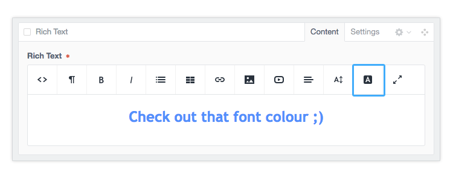

## Redactor Font Colour
*Craft 2.5+*

1. Download the ZIP file and extract
2. Move the 'redactorfontcolor' to your 'craft/pugins/' directory
3. Update your redactor config in 'craft/config/redactor/

>  Check your redactor field in Craft to see which config file it uses it will usually be either Custom.json, Simple.json or Standard.json

**Add 'fontcolor' to the plugins array:**

``` javascript
{
	"buttons": [
		"formatting",
		"bold",
		"italic",
		"unorderedlist",
		"orderedlist",
		"link",
		"image"
	],
	"plugins":[
		"fontcolor",
		"fullscreen",
		"source",
		"table",
		"video",
	],
	"toolbarFixed": true,
	"imageResizable": true,
	"imagePosition": true
}
```

### Boom, you're done ;)



Any questions, bugs or feedback [hit me up](https://dougthwaites.nz/say-hi)
